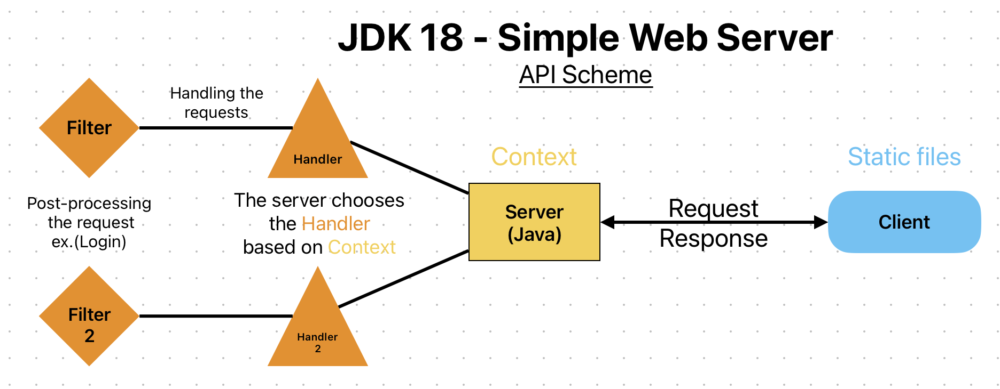

# PPJava
- Repository k předmětu - Pokročilé programování na platformě Java.
# Lab 1
__Úkol: Implementujte a otestujte novou feature z JDK xx release.__
- Jako novou feature jsem si vybral **Simple Web Server** z vydání Standard Edition 18 Development Kit (JDK 18) na Java SE platform.
- Feature jsem si zvolil protože si chci vyzkoušet jak vypadá spuštění aplikace z localhostu na server. 


### Simple Web Server (JDK 18)
- The Simple Web Server offers a bare-bones web server that serves static files. It’s described as being useful for testing and debugging.
- Part of the jdk.httpserver module 
- [JDK-8260510](https://bugs.openjdk.java.net/browse/JDK-8260510)

[](https://www.youtube.com/watch?v=F-hdvdrF3qk)

__Disadvantages:__
- SWS supports only **HTTP/1.1**; 
- HTTP/2 and HTTPS are not supported *Makes sense since it's only for debugging.*

### Notes 
- In your App directory run: 

`jwebserver`

    ```java
    Binding to loopback by default. For all interfaces use "-b 0.0.0.0" or "-b ::".
    Serving /Java/PPJava and subdirectories on 127.0.0.1 port 8000
    URL http://127.0.0.1:8000/
    ```
